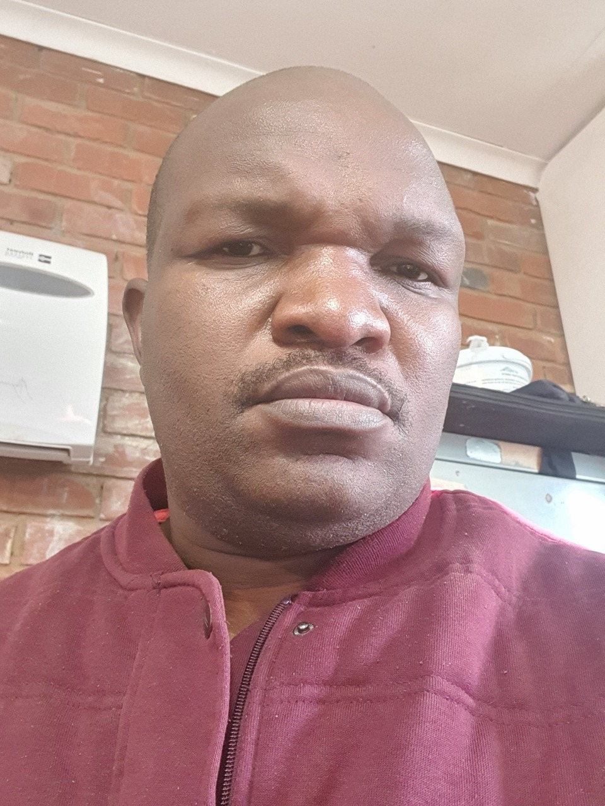

<!DOCTYPE html>
<html lang="en">
<head>
  <meta charset="UTF-8" />
  <meta name="viewport" content="width=device-width, initial-scale=1.0" />
  <title>Lucky Marange - Portfolio</title>
  
</head>
<body>
  

    
    <ul>
      <li><a href="#about">About</a></li>
      <li><a href="#interests">Interests</a></li>
      <li><a href="#education">Education</a></li>
      <li><a href="#skills">Skills</a></li>
      <li><a href="#contact">Contact</a></li>
    </ul>
  

  

    <h2 id="about">About Me</h2>
    
Hi there! I'm Lucky Marange, an aspiring IT Professional and educator passionate about solving problems and learning continuously. I'm studying BSc IT at North-West University (expected 2026). I bring strong analytical skills, experience in STEM education, and a drive for innovation.

    <h2 id="interests">Interests</h2>
    <ul>
      <li>Software Engineering</li>
      <li>Cybersecurity</li>
      <li>Mathematics & Physics</li>
      <li>Artificial Intelligence</li>
      <li>Data Science</li>
      <li>Web Development</li>
    </ul>

    <h2 id="education">Education</h2>
    

      <h3>BSc Information Technology (In Progress)</h3>
      
<strong>North-West University</strong>

      
January 2023 – Present

      <ul>
        <li>Specializing in Software Development and Cybersecurity.</li>
        <li>Relevant courses: DBMS, Java, Web Dev, Networks, Info Systems.</li>
        <li>Practical project experience applying theory to real-world IT.</li>
      </ul>
    

    

      <h3>BSc Mathematics and Physics</h3>
      
<strong>University of South Africa (UNISA)</strong>

      
January 2019 – December 2023

      <ul>
        <li>Advanced mathematics and physical science studies.</li>
        <li>Built problem-solving, research, and analytical skills.</li>
      </ul>
    

    

      <h3>Bachelor of Education (B.Sc.Ed)</h3>
      
<strong>University of South Africa (UNISA)</strong>

      
January 2014 – December 2017

      <ul>
        <li>Majored in Physical Sciences and Mathematics.</li>
        <li>Experience in curriculum design and student engagement.</li>
      </ul>
    

    

      <h3>Charlton Vos College</h3>
      
January 2008 – Present

      <ul>
        <li>Achieved 100% pass rates in Physics and Math for 15+ years.</li>
        <li>Created engaging lesson plans, improved academic performance.</li>
        <li>Led software development simulation projects in Java and SQL.</li>
        <li>Applied cybersecurity best practices in IT training.</li>
      </ul>
    

    <h2 id="skills">Skills</h2>
    <ul>
      <li>Languages: Java, Python, C++, JavaScript</li>
      <li>Frameworks: Spring, Django, React</li>
      <li>Databases: MySQL, MongoDB</li>
      <li>OS: Windows, Linux, macOS</li>
      <li>Soft Skills: Problem-solving, communication, teamwork</li>
    </ul>

    <h2 id="contact">Contact</h2>
    
Email: <a href="mailto:marangelucky@gmail.com">marangelucky@gmail.com</a>

    
LinkedIn: <a href="https://linkedin.com/in/luckymarange">linkedin.com/in/luckymarange</a>

    
GitHub: <a href="https://github.com/luckymarange">github.com/luckymarange</a>

  

</body>
</html>
